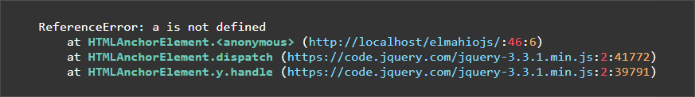

# stacktrace.js
 


A simple and easy jQuery plugin for highlighting JavaScript stack traces

#### Demo


#### Initialization
```
$('.stacktrace').jsStack();
```

#### Default values for classes
```
$('.stacktrace').jsStack({
    method: 'st-methodName',
    file: 'st-fileName',
    line: 'st-lineNumber',
    column: 'st-column'
});
```

#### Ready to go css
```
pre {padding: 20px 10px;}
pre, code {background-color: #333;color: #ffffff;}
.st-methodName {color: #70c9ba;font-weight: bolder;}
.st-column {color: #f8b068;}
.st-lineNumber {color: #ff4f68;}
.st-fileName {color: #85dbff;}
```
